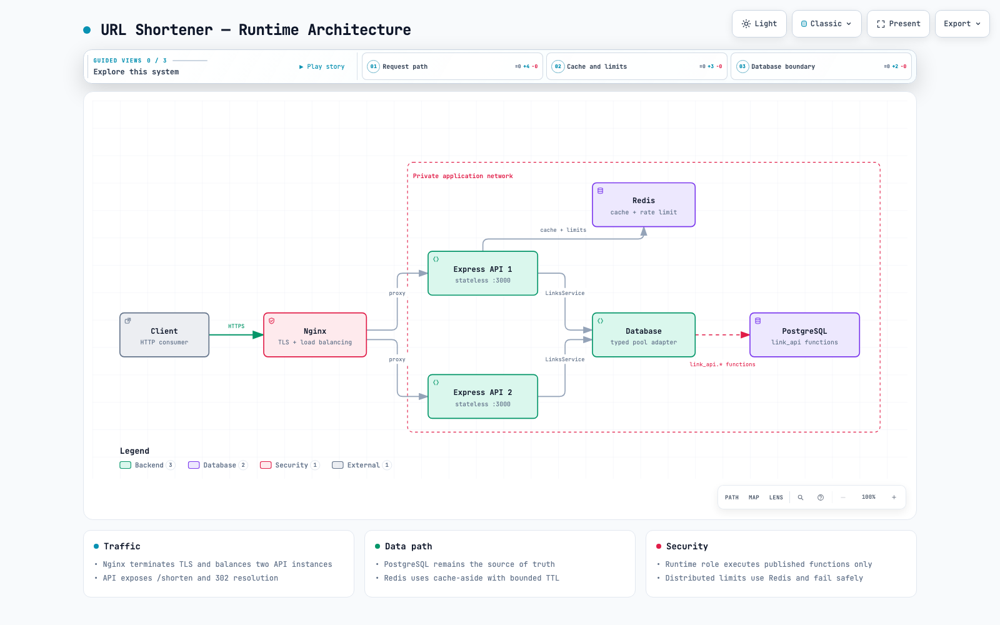

# URL Shortener

[](https://nodejs.org/) [](https://www.typescriptlang.org/) [](https://expressjs.com/) [](https://www.postgresql.org/) [](https://redis.io/) [](https://nginx.org/) [](tests/)

A secure, stateless URL shortener built with TypeScript, Node.js, Express, PostgreSQL, Redis, and Nginx. PostgreSQL is the source of truth. Node.js accesses it only through the typed `Database` class and the published `link_api` functions; the runtime role has no direct table privileges.




## Features

- `POST /shorten` validates public HTTP(S) destinations and returns an eight-character Base62 code.
- `GET /:code` returns a `302` redirect only for an enabled, non-expired link.
- PostgreSQL schema and functions are versioned, normalized to 3NF, and protected by least-privilege roles.
- Redis provides cache-aside lookups and distributed rate limiting. PostgreSQL remains authoritative on every resolution.
- Security controls reject credentials, dangerous schemes, private or reserved destinations, oversized inputs, and unsafe proxy headers.
- The service is designed for two stateless Express instances behind Nginx.

## Run and test

Requires Node.js 22 or newer.

```sh
cp .env.example .env
sh scripts/setup-env.sh
npm install
npm run typecheck
node --import tsx --test tests/*.test.ts
```

The current suite contains 21 passing tests covering contracts, adapters, HTTP behavior, security, rate limiting, architecture enforcement, and the real PostgreSQL integration. SQL migration and permission checks are documented in [`docs/test-report.md`](docs/test-report.md).

## Database setup

Bootstrap roles with a PostgreSQL administrator, then apply the migration as the migrator role:

```sh
sh scripts/db-bootstrap.sh
sh scripts/db-migrate.sh
```

The runtime account can execute only the approved functions in `link_api`; direct table access, DDL, temporary tables, and maintenance functions are denied. See [`docs/database.md`](docs/database.md).

## Architecture documentation

- [System design and capacity assumptions](docs/system-design.md)
- [HTTP and database contracts](docs/contracts.md)
- [Security and distributed rate limiting](docs/security.md)
- [API implementation](docs/api.md)
- [Archify interactive diagram](docs/url-shortener-architecture.html)
- [Graphify interactive code graph](graphify-out/graph.html)
- [Verification report and measured EXPLAIN plans](docs/test-report.md)

## Current validation status

Code, API, security, adapters, PostgreSQL permissions, concurrency, and index plans have been verified. Docker Compose/Nginx deployment still requires an available local container runtime; no unmeasured performance claim is made.
