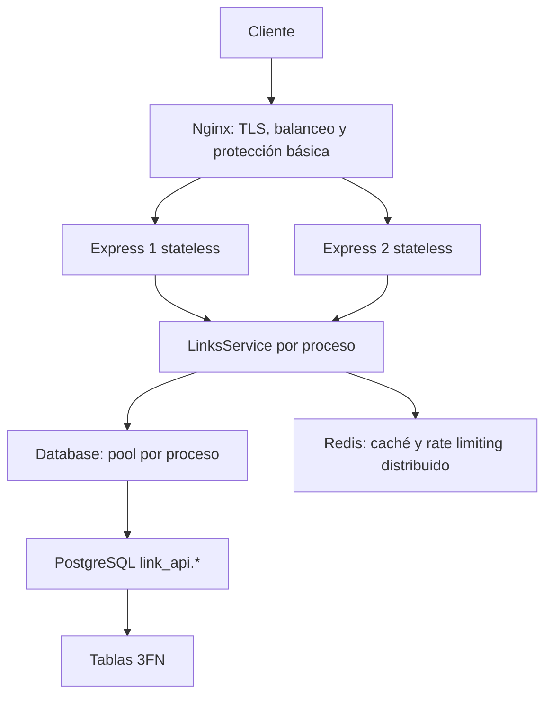
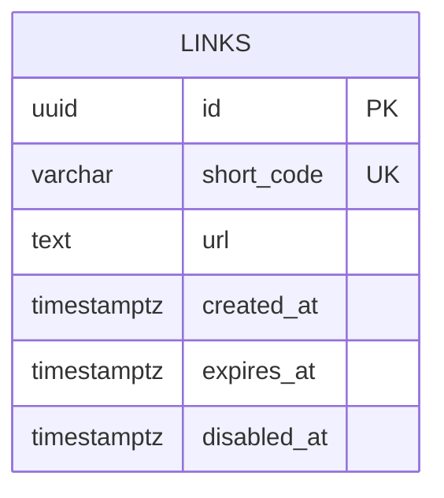

# URL Shortener — diseño del sistema

## Arquitectura

Nginx es el único servicio publicado. Dos procesos API comparten PostgreSQL y Redis por red interna; cada uno tiene su pool. TLS se termina en Nginx con certificados montados. El lab puede usar certificados autofirmados documentados; producción requiere certificados confiables, rotación y secretos gestionados. No se incorporan microservicios, Kafka ni Kubernetes.

## Flujos

POST /shorten: Nginx limita tamaño y tasa básica → middleware aplica límites Redis global y de creación → valida JSON, URL y expiración → genera 8 caracteres Base62 con aleatoriedad criptográfica sin sesgo → Database.createLink invoca link_api.create_link → UNIQUE decide colisión y se reintenta hasta cinco veces → se devuelve 201. El destino se guarda una vez por código; distintas creaciones de la misma URL son válidas. No se hacen requests server-side.

GET /:code: valida código → aplica límites Redis global y de redirección → obtiene posible caché → siempre resuelve estado actual mediante link_api.resolve_link → ausente responde 404 y elimina caché → vigente rellena/refresca caché dentro de su TTL y responde 302 no-store. Redis fallido omite caché y limitador GET; PostgreSQL fallido produce 503. La validación SQL por hit es una decisión deliberada para impedir redirecciones por entradas deshabilitadas obsoletas. No se promete reducir consultas SQL gracias a esta caché.

## Modelo e índices

Una entidad es suficiente. Cada atributo depende de la clave completa, sin dependencias transitivas ni campos derivados. No se almacenan shortUrl, hostname redundante ni contadores. No se inventan FK sin entidades relacionadas. PK UUID y UNIQUE short_code soportan identidad y lookup; índice parcial de expires_at no nulo permite purga por lote ordenada. CHECK validan código y longitudes, esquemas HTTP/HTTPS y expiración posterior a creación; la validación detallada del destino ocurre también antes de SQL. La migración documenta exactamente las restricciones implementadas.

PostgreSQL frente a SQLite: dos instancias concurrentes requieren base central, pool, control de permisos por operación, funciones SECURITY DEFINER y herramientas de análisis/backup. SQLite es útil para aplicaciones embebidas, pero no ofrece este contrato de roles y API SQL publicado. El schema privado no es accesible al runtime. SECURITY DEFINER usa search_path seguro, nombres cualificados y propietario sin login; PUBLIC no puede ejecutar las funciones.

## Capacidad: hipótesis, no mediciones

Supongamos 100 creaciones/s y 1000 redirecciones/s de pico, carga media del 10%, retención media de 30 días. 10 creaciones/s × 86400 × 30 = 25.920.000 enlaces retenidos. Con URL media de 300 bytes y presupuesto de 600 bytes por fila e índices, son aproximadamente 15,6 GB decimales; reservar al menos el doble para WAL, vacuum y crecimiento, más backups separados. Códigos: 62^8 = 218.340.105.584.896 combinaciones; a 25,92 millones de códigos ocupados una nueva elección colisiona con probabilidad aproximada 1,19e-7. La restricción UNIQUE sigue siendo obligatoria.

Todos los GET consultan PostgreSQL: el pico hipotético exige al menos 1100 operaciones SQL/s. Dos pools de 10 conexiones suman 20; con latencia SQL media de 10 ms, el límite teórico sin sobrecarga sería 2000 operaciones/s. No es capacidad comprobada ni garantía: contención, disco, red y colas reducen esa cifra. Redis contendría por ejemplo 100.000 destinos calientes × 600 bytes ≈ 60 MB de payload, con memoria adicional para metadatos y limitadores. La prueba de carga debe reportar hardware, duración, concurrencia, QPS efectivo, p50/p95/p99, errores y hit ratio.

## Seguridad, datos y límites del lab

La política de destinos rechaza localhost, nombres internos y rangos IP privados/reservados tanto IPv4 como IPv6, con normalización mediante URL. No se resuelven DNS ni se visitan destinos; un dominio público puede cambiar su resolución y esta política no garantiza seguridad del navegador. El servicio público de redirección puede usarse para phishing: moderación, autenticación y análisis de reputación quedan fuera del alcance y serían necesarios para un servicio público comercial.

Logs contienen ID de request, método, estado, duración y contador por instancia; nunca URL original, query string, credenciales o secretos. Rate-limit keys pueden usar hash de IP y tienen TTL; no se guarda historial de navegación. El destino sigue siendo dato potencialmente sensible en PostgreSQL y Redis: controlar acceso, cifrado de volúmenes/backups y gestión de secretos. Retención se expresa mediante expiresAt; enlaces sin expiración requieren una política operativa explícita antes de producción. Purga por rol de mantenimiento, no runtime. Backups PostgreSQL regulares cifrados, retención limitada y ejercicios de restauración; un volumen Docker persistente no es un backup.

Shutdown: dejar de aceptar tráfico, cerrar HTTP con timeout, cerrar pool y Redis. Healthchecks distinguen proceso y dependencia. Redis degradado permite GET y bloquea POST; eso reduce protección distribuida de GET y debe observarse. El lab no incluye alta disponibilidad de PostgreSQL/Redis, gestión automática de certificados, moderación ni recuperación regional. Los resultados ejecutados y los bloqueos del entorno se documentan sin presentarlos como pruebas exitosas.
