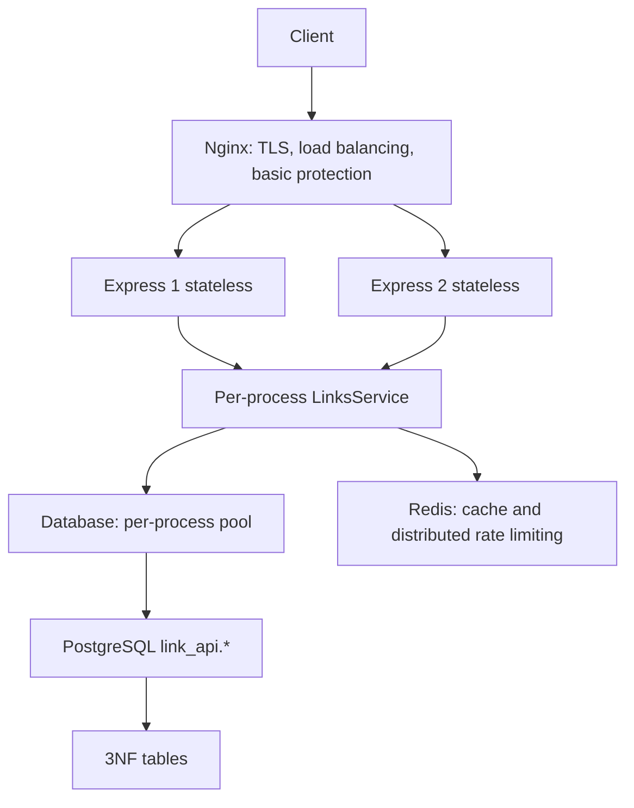
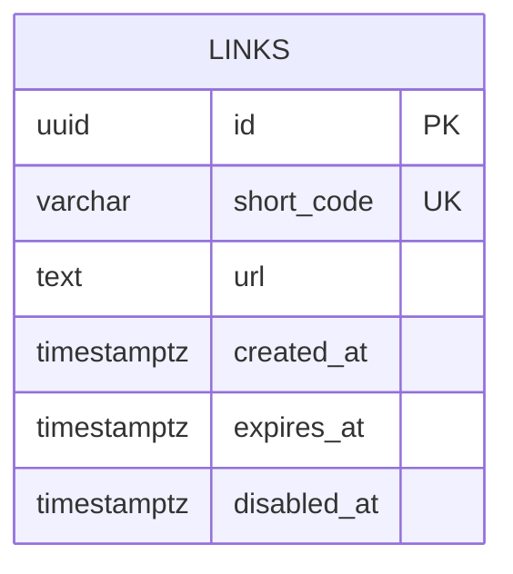

# URL Shortener — System Design

## Architecture

Nginx is the only public service. Two API processes share PostgreSQL and Redis over an internal network; each process owns its pool. TLS terminates at Nginx with mounted certificates. Self-signed certificates are acceptable for the lab; production requires trusted certificates, rotation, and managed secrets. This design does not add microservices, Kafka, or Kubernetes.

## Flows

`POST /shorten`: Nginx limits size and basic rate → Redis global and creation limits → JSON, URL, and expiration validation → eight unbiased cryptographic Base62 characters → `Database.createLink` calls `link_api.create_link` → the UNIQUE constraint determines collisions and retries up to five times → return 201. The destination is stored once per code; creating multiple codes for the same URL is valid. The server never requests the destination.

`GET /:code`: validate code → apply Redis global and redirect limits → read possible cache entry → always resolve current state through `link_api.resolve_link` → missing returns 404 and removes cache → current entry refreshes cache within TTL and returns 302 `no-store`. If Redis fails, cache and GET limiting are skipped; PostgreSQL failure returns 503. SQL validation on every hit deliberately prevents redirects to stale disabled records. This cache does not promise fewer SQL queries.

## Data model and indexes

One entity is sufficient. Every attribute depends on the full key, with no transitive dependencies or derived fields. The schema does not store `shortUrl`, a redundant hostname, or counters. A partial `(expires_at,id)` index supports ordered batch purges; the UNIQUE constraint supports code lookup. CHECK constraints enforce code, length, HTTP/HTTPS scheme, and expiration rules; detailed destination validation also runs before SQL.

PostgreSQL is used instead of SQLite because concurrent instances require a central database, connection pools, operation-level permissions, `SECURITY DEFINER` functions, and backup/analysis tooling. The private schema is inaccessible to runtime. Security-definer functions use a safe search path, qualified names, and a non-login owner; PUBLIC cannot execute them.

## Capacity: assumptions, not measurements

Assume 100 creations/s and 1,000 redirects/s at peak, 10% average load, and 30-day retention. That is 25,920,000 retained links. At a 300-byte average URL and a 600-byte row-plus-index budget, storage is about 15.6 decimal GB; reserve at least twice that for WAL, vacuum, growth, and separate backups. There are 62^8 = 218,340,105,584,896 codes; with 25.92 million occupied codes, a new random choice collides with an approximate probability of 1.19e-7. UNIQUE remains mandatory.

Every GET queries PostgreSQL, so the hypothetical peak needs at least 1,100 SQL operations/s. Two pools of 10 connections provide 20; with 10 ms average SQL latency, the theoretical no-overhead ceiling is 2,000 operations/s. This is neither measured capacity nor a guarantee: contention, storage, network, and queues reduce it. A Redis cache holding 100,000 hot destinations at 600 bytes would use about 60 MB of payload plus metadata and limiter overhead. Load tests must report hardware, duration, concurrency, effective QPS, p50/p95/p99, errors, and hit ratio.

## Security, data handling, and lab limits

Destination policy rejects localhost, internal names, and private/reserved IPv4 and IPv6 ranges after URL normalization. DNS is not resolved and destinations are never fetched; a public domain can change its resolution, so this policy is not browser security. A public redirect service can be abused for phishing; moderation, authentication, and reputation analysis are outside this lab and required for a commercial service.

Logs contain request ID, method, status, duration, and per-instance counters, never the original URL, query string, credentials, or secrets. Rate-limit keys may use an HMAC of the IP with a TTL; browsing history is not stored. Destinations remain potentially sensitive data in PostgreSQL and Redis: control access, encrypt volumes/backups, and manage secrets. Expiration is expressed by `expiresAt`; non-expiring links require an explicit operational policy before production. Purging is performed by the maintenance role, never runtime. PostgreSQL backups should be encrypted, retained for a limited period, and restore-tested; a persistent Docker volume is not a backup.

Shutdown stops accepting traffic, closes HTTP with a timeout, then closes the pool and Redis. Health checks distinguish process health from dependency readiness. Degraded Redis allows GET and blocks POST; this reduces distributed GET protection and must be monitored. The lab does not include PostgreSQL/Redis high availability, automatic certificate management, moderation, or regional recovery. Executed results and environment blockers are documented without presenting them as successful tests.
